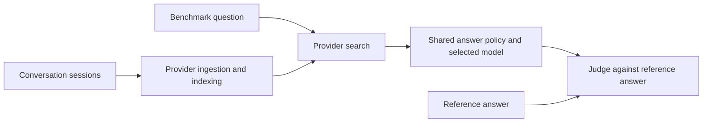

# Comparing memory providers with MemoryBench

MemoryBench asks whether a provider can retain useful conversation history and return enough evidence for a model to answer a later question. For Atlas Memory Service, mem0, and the other integrations, the result describes a configured pipeline: ingestion, memory formation, retrieval, answer generation, and judging. A score belongs to that configuration and dataset.

Start with the [LoCoMo explainer](locomo.md). Use the [benchmark chapter template](template.md) to add LongMemEval and subsequent benchmarks without changing the comparison structure.

## The narrative across benchmarks

The central question is whether an assistant can use past conversations accurately, within an acceptable response time and context budget. Each benchmark supplies a different test of that ability.

| Benchmark | Question it adds to the narrative | Current coverage in this guide |
| --- | --- | --- |
| LoCoMo | Can memory preserve who said what and when across repeated conversations between two people? | Dataset, implementation, historical results, and a worked failure analysis |
| LongMemEval | Can memory recover user and assistant facts, preferences, information across sessions, time relationships, and updates? | Next chapter; these are categories exposed by the local adapter |
| ConvoMem | Can memory handle user facts, assistant facts, preferences, changes, implicit connections, and abstention? | Future chapter; these are categories exposed by the local adapter |

Keep scores separate by benchmark and category. If an overall portfolio score is later needed, define its weights first. Combining all questions would let the largest dataset dominate the conclusion.

## What the comparison controls

Providers receive the conversation history for each selected question. Search receives the question, not its reference answer. The answering model sees retrieved evidence. The judge receives the reference answer separately. This makes answer accuracy a test of the whole memory-assisted answering pipeline.

The current search phase requests ten results. The shared answer policy keeps provider order, removes embedding vectors, and fits provider JSON into an 8,000-token evidence budget. It may include a marked excerpt of the next record before stopping. Generation allows at most 1,000 output tokens and uses temperature zero where supported. Compare the same answering model and verify `answerPolicy.version = shared-v1` in every answer checkpoint. See the [search phase](../../src/orchestrator/phases/search.ts) and [answer policy](../../src/prompts/answer.ts).

The answer prompt is shared, but judge prompts can still differ. Atlas and mem0 use the default category-aware judge. Zep supplies a custom judge prompt, so a shared judge model alone does not establish equivalent grading. See [judge selection](../../src/judges/base.ts).

## What each provider configuration means

These descriptions concern the adapters in this repository as inspected on October 8, 2026. They do not describe every feature available from each vendor.

| Provider ID | What this suite exercises | How to explain its role |
| --- | --- | --- |
| `atlas-agent-engine` | Records conversation turns, then searches semantic and episodic memories | Atlas Memory Service with service-side extraction |
| `atlas-agent-engine-direct` | Saves transcript chunks as episodes and searches episodic memory | Atlas transcript retrieval baseline; helps investigate what extraction preserves or loses |
| `mem0` | Uses the v2 ingestion API, custom extraction instructions, asynchronous writes, and memory search; graph is disabled | mem0 extracted-memory comparison |
| `supermemory` | Ingests sessions and uses hybrid memory search with source chunks requested | Memory retrieval with source evidence |
| `zep` | Searches graph edges and nodes with cross-encoder reranking | Graph retrieval configuration; custom grading needs separate treatment |
| `rag` | Extracts memories with an LLM, chunks and embeds them, then combines BM25 and vector retrieval | Local hybrid retrieval baseline that also includes extraction |
| `filesystem` | Extracts memories to local files and searches with term matching | Simple local memory baseline |

The [provider registry](../../src/providers/index.ts) links these IDs to their implementations. Keep Atlas extraction and direct mode as distinct rows in every results table. A difference between them motivates investigation; it does not isolate extraction as the sole cause because the stored records and retrieval sources also differ.

## How to read a result

| Measure | Meaning | Interpretation limit |
| --- | --- | --- |
| Answer accuracy | Fraction of evaluated answers judged correct | Depends on memory, answering model, reference answer, and judge |
| Per-category accuracy | Correct answers divided by evaluated questions in each category | Show denominators; two questions cannot establish category strength |
| Mean search latency | Time spent in the provider search call | Excludes ingestion, indexing, answer generation, and judging |
| Context tokens | Evidence tokens supplied to the answering model | Includes serialized metadata; excludes extraction, storage, embeddings, and output cost |
| Completion coverage | Evaluated questions divided by intended questions | Report separately; report accuracy uses evaluated questions |
| Hit@K and MRR | Whether the judge finds relevant retrieved material, and how early it appears | Relevant material may still lack the fact needed for a correct answer |

`MemScore` displays accuracy, mean search milliseconds, and average context tokens. It is a three-part summary. Lower token use only helps if the remaining evidence supports good answers.

The [retrieval evaluator](../../src/orchestrator/phases/retrieval-eval.ts) judges relevance within up to ten returned records. It does not measure recall against all annotated source evidence. Its NDCG uses relevance found within the returned set. Older reports contain `recallAtK` and `f1AtK`; do not present those as corpus recall. See [report aggregation](../../src/orchestrator/phases/report.ts) for denominators and latency calculations.

## Evidence needed for a provider claim

Record the exact dataset and checksum, selected question IDs, category and conversation coverage, code revision plus local changes, provider settings, service and SDK versions, extraction and embedding models where known, answering model, judge model and prompt, and answer-policy version. Preserve reports, checkpoints, and retrieved evidence with the claim.

For each benchmark, publish accuracy with counts, completion coverage, category results, search latency, and context tokens. Keep ingestion and readiness times separate. Atlas extraction readiness is inferred from searchable episodes after a minimum wait and stability interval; mem0 polls event status. Those timings include different readiness policies.

Use the same question IDs across providers. The `compare` command creates a shared selection manifest. Its default per-category sampling is consecutive, which can overrepresent early conversations. Random sampling also needs its saved IDs to be reproducible. For broader claims, cover multiple conversations, repeat runs, inspect paired disagreements, and account for questions sharing the same conversation when estimating uncertainty.

## A reusable explanation

"We compare Atlas Memory Service and other providers on the same conversation-memory tasks. Each benchmark tests a particular ability. We hold the question set and answering policy constant, then report answer quality, retrieval time, and evidence size. We inspect failures to see whether a fact was lost during memory formation, missed in retrieval, excluded by the evidence budget, or misused in the answer. Conclusions stay tied to the tested provider configuration and dataset."
